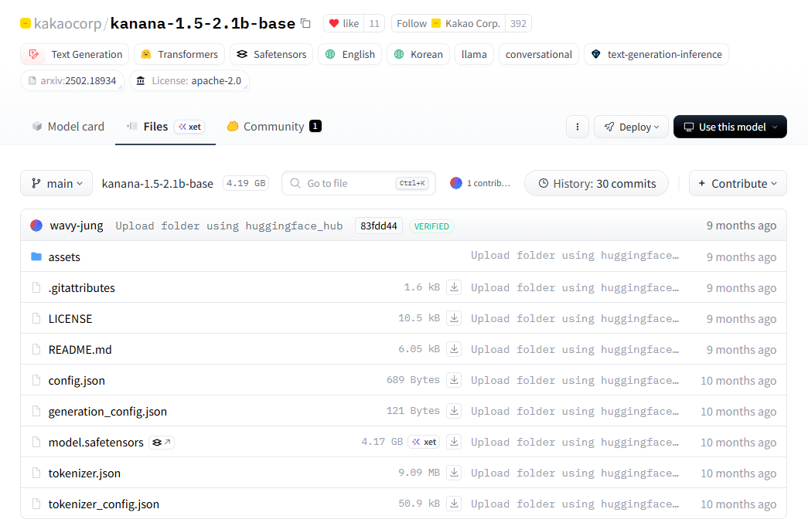

# LLM Download Path

## 목차

* [1. 공통 사항](#1-공통-사항)
* [2. 각 모델 별 Hugging Face 원본 모델 경로](#2-각-모델-별-hugging-face-원본-모델-경로)
  * [2-1. Oh-LoRA v1 (2025.04.08 - 04.25)](#2-1-oh-lora-v1--20250408---0425-)
  * [2-2. Oh-LoRA v2 (2025.05.02 - 05.21)](#2-2-oh-lora-v2--20250502---0521-)
  * [2-3. Oh-LoRA v3 (2025.05.26 - 06.05)](#2-3-oh-lora-v3--20250526---0605-)
  * [2-4. Oh-LoRA v4 (2025.06.24 - 06.30)](#2-4-oh-lora-v4--20250624---0630-)
  * [2-5. Oh-LoRA ML Tutor (2025.07.02 - 09.25)](#2-5-oh-lora-ml-tutor--20250702---0925-)

## 1. 공통 사항

Oh-LoRA의 각 버전 별, **해당 버전의 Fine-Tuned LLM 을 다운로드 받은 폴더 (이하 'Fine-Tuned LLM 폴더')** 에서 다음과 같이 실행

* **1.** [각 모델 별 Hugging Face 원본 모델 경로](#2-각-모델-별-hugging-face-원본-모델-경로) 에서, 다운로드 받은 Oh-LoRA LLM 모델에 해당하는 버전의 '원본 모델 다운로드 링크' 에 표시된 Hugging Face 링크에서 **모든 파일** 을 다운로드
  * 아래와 같이 **[Files]** 탭에 파일 존재
  * 모델에 따라 **전체 크기가 약 5.0 GB 정도** 일 수 있음



* **2.** 해당 파일들을 **특정 폴더 경로 (사용자 지정 임의 경로)** 에 저장
* **3.** 이후, **Fine-Tuned LLM 폴더** 에서 ```adapter_config.json``` 파일을 열어서, ```base_model_name_or_path``` 부분을 **2.** 의 해당 폴더의 절대 경로로 변경

```
"base_model_name_or_path": "C:\\Users\\20151\\Documents\\AI_Projects\\2025_07_02_OhLoRA_ML_Tutor/llm_original_models/kananai_original"
```

## 2. 각 모델 별 Hugging Face 원본 모델 경로

* **'HuggingFace 원본 모델 다운로드 링크'가 1개** 인 경우, 'Fine-Tuned LLM 폴더'에서 사용 가능한 원본 모델이 1개뿐임을 의미하므로 어떤 원본 모델을 사용할지에 대한 정보를 **따로 제공하지 않습니다.**

### 2-1. [Oh-LoRA v1 (2025.04.08 - 04.25)](2025_04_08_OhLoRA)

* Fine-Tuned LLM 폴더
  * ```polyglot_fine_tuned``` (use **Polyglot-Ko 1.3B**)

* HuggingFace 원본 모델 다운로드 링크
  * Gemma-2 2B (❌ 미 채택)
    * [gemma-2-2b-it Hugging-Face](https://huggingface.co/unsloth/gemma-2-2b-it/tree/main) 
  * Polyglot-Ko 1.3B (✅ 최종 채택)
    * [Polyglot-Ko 1.3B Hugging-Face](https://huggingface.co/EleutherAI/polyglot-ko-1.3b)

### 2-2. [Oh-LoRA v2 (2025.05.02 - 05.21)](2025_05_02_OhLoRA_v2)

* Fine-Tuned LLM 폴더
  * ```polyglot_eyes_mouth_pose_fine_tuned```
  * ```polyglot_memory_fine_tuned```
  * ```polyglot_output_message_fine_tuned```
  * ```polyglot_summary_fine_tuned```

* HuggingFace 원본 모델 다운로드 링크
  * Polyglot-Ko 1.3B
    * [Polyglot-Ko 1.3B Hugging-Face](https://huggingface.co/EleutherAI/polyglot-ko-1.3b)

### 2-3. [Oh-LoRA v3 (2025.05.26 - 06.05)](2025_05_26_OhLoRA_v3)

* Fine-Tuned LLM 폴더
  * ```polyglot_eyes_mouth_pose_fine_tuned``` (use **Polyglot-Ko 1.3B**)
  * ```polyglot_memory_fine_tuned``` (use **Polyglot-Ko 1.3B**)
  * ```kanana_output_message_fine_tuned``` (use **Kanana-2.1 1.5B Base**)
  * ```kanana_summary_fine_tuned``` (use **Kanana-2.1 1.5B Base**)

* HuggingFace 원본 모델 다운로드 링크
  * Polyglot-Ko 1.3B
    * [Polyglot-Ko 1.3B Hugging-Face](https://huggingface.co/EleutherAI/polyglot-ko-1.3b)
  * Kanana-2.1 1.5B Base
    * [Kanana-2.1 1.5B Base Hugging-Face](https://huggingface.co/kakaocorp/kanana-1.5-2.1b-base)

### 2-4. [Oh-LoRA v4 (2025.06.24 - 06.30)](2025_06_24_OhLoRA_v4)

* Fine-Tuned LLM 폴더
  * ```polyglot_eyes_mouth_pose_fine_tuned``` (use **Polyglot-Ko 1.3B**)
  * ```polyglot_memory_fine_tuned``` (use **Polyglot-Ko 1.3B**)
  * ```kananai_output_message_fine_tuned``` (use **Kanana-2.1 1.5B Instruct**)
  * ```kanana_summary_fine_tuned``` (use **Kanana-2.1 1.5B Base**)

* HuggingFace 원본 모델 다운로드 링크
  * Polyglot-Ko 1.3B
    * [Polyglot-Ko 1.3B Hugging-Face](https://huggingface.co/EleutherAI/polyglot-ko-1.3b)
  * Kanana-2.1 1.5B Base
    * [Kanana-2.1 1.5B Base Hugging-Face](https://huggingface.co/kakaocorp/kanana-1.5-2.1b-base)
  * Kanana-2.1 1.5B Instruct
    * [Kanana-2.1 1.5B Instruct Hugging-Face](https://huggingface.co/kakaocorp/kanana-1.5-2.1b-instruct-2505)

### 2-5. [Oh-LoRA ML Tutor (2025.07.02 - 09.25)](2025_07_02_OhLoRA_ML_Tutor)

* Fine-Tuned LLM 폴더
  * ```ai_qna/models/kananai_sft_final_fine_tuned```
  * ```ai_quiz/models/kananai_sft_final_fine_tuned_10epochs```
  * ```ai_interview/models/kananai_sft_final_fine_tuned_5epochs```

* HuggingFace 원본 모델 다운로드 링크
  * Kanana-2.1 1.5B Instruct
    * [Kanana-2.1 1.5B Instruct Hugging-Face](https://huggingface.co/kakaocorp/kanana-1.5-2.1b-instruct-2505)
