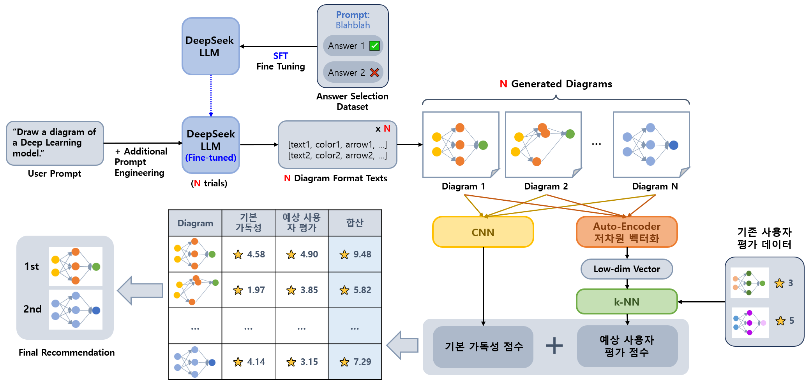
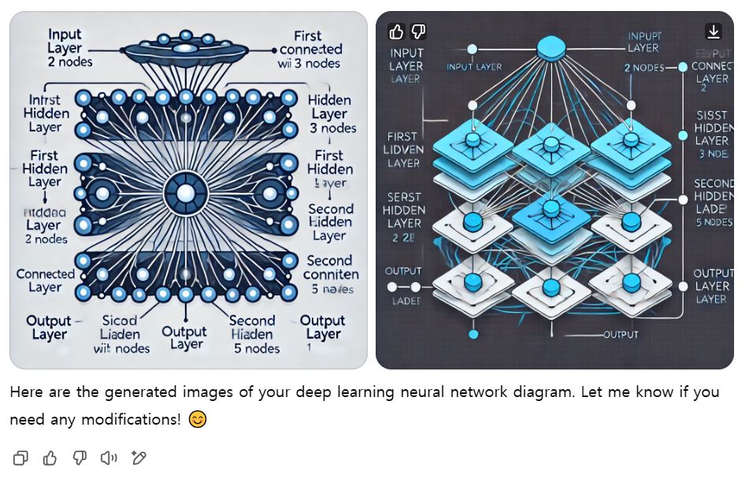

## 목차

* [1. 프로젝트 개요](#1-프로젝트-개요)
  * [1-1. 프로젝트 진행 배경](#1-1-프로젝트-진행-배경)
* [2. 기술 분야 및 사용 기술](#2-기술-분야-및-사용-기술)
  * [2-1. 관련 논문](#2-1-관련-논문)
  * [2-2. 사용한 Python 라이브러리](#2-2-사용한-python-라이브러리)
* [3. 프로젝트 일정](#3-프로젝트-일정)
* [4. 프로젝트 상세 설명](#4-프로젝트-상세-설명)
  * [4-1. 도식 생성을 위한 LLM 프롬프트](#4-1-도식-생성을-위한-llm-프롬프트)
  * [4-2. LLM Fine-Tuning](#4-2-llm-fine-tuning)
  * [4-3. 생성된 이미지의 저차원 벡터화](#4-3-생성된-이미지의-저차원-벡터화)
  * [4-4. 최종 이미지 생성 및 순위 산출](#4-4-최종-이미지-생성-및-순위-산출)
* [5. 프로젝트 진행 중 이슈 및 해결 방법](#5-프로젝트-진행-중-이슈-및-해결-방법)

## 1. 프로젝트 개요

* DeepSeek LLM 을 이용하여 **사용자의 요구 사항에 맞는** 머신러닝 프로세스 또는 딥러닝 모델 등을 설명하기 위한 **Diagram 을 생성하기 위한 정형화된 포맷의 텍스트** 를 생성한다.
* 해당 텍스트를 이용하여 일반 알고리즘으로 Diagram 을 생성한다.
* 다음과 같은 방법을 이용하여 보다 가독성 좋은 Diagram 을 생성한다.
  * **[DPO 또는 ORPO](https://github.com/WannaBeSuperteur/AI-study/blob/main/AI%20Basics/LLM%20Basics/LLM_기초_Fine_Tuning_DPO_ORPO.md) 와 같은 기술로 LLM 을 Fine-Tuning** 하여, LLM 자체적으로 사용자 입장에서 가독성 높은 Diagram 생성
* 가독성이 더욱 향상된 **개별 사용자 맞춤형** Diagram 생성을 위해 다음을 적용한다.
  * 여러 개의 Diagram 을 생성한 후, **기본 가독성 점수 + 예상 사용자 평가 점수** 가 높은 순으로 정렬하여 상위권의 Diagram 들을 사용자에게 표시
  * [CNN (Conv. Neural Network)](https://github.com/WannaBeSuperteur/AI-study/blob/main/Image%20Processing/Basics_CNN.md) 을 이용하여 가독성 높은 Diagram 인지의 **기본 가독성 점수** 산출
  * 생성된 이미지를 [Auto-Encoder](https://github.com/WannaBeSuperteur/AI-study/blob/main/Generative%20AI/Basics_Auto%20Encoder.md) 로 저차원 벡터화하고, [k-Nearest Neighbor](https://github.com/WannaBeSuperteur/AI-study/blob/main/AI%20Basics/Machine%20Learning%20Models/%EB%A8%B8%EC%8B%A0%EB%9F%AC%EB%8B%9D_%EB%AA%A8%EB%8D%B8_KNN.md) 의 아이디어를 이용하여 **예상 사용자 평가 점수** 산출



### 1-1. 프로젝트 진행 배경

* [DS/ML/DL 기초 정리](https://github.com/WannaBeSuperteur/AI-study/tree/main/AI%20Basics) 중 모델 설명을 위한 다이어그램을 PowerPoint 등을 이용하여 그리는 데 오랜 시간 필요
  * 기초적인 부분은 AI에게 맡길 수 없을까?
* ChatGPT 에서 제공하는 DALL-E 등을 이용하여 생성할 시, 아래와 같이 **의도에 전혀 맞지 않고, 부자연스러운 부분이 있는 이미지** 가 생성됨
  * 따라서, 이 문제 해결에 **DALL-E 를 이용하기는 어려움**

| 사용자 쿼리                                                                                                                     |
|----------------------------------------------------------------------------------------------------------------------------|
| Draw a diagram of a deep learning model with 2 input nodes, 3 and 5 hidden nodes for each hidden layer, and 1 output node. |

| 결과물 (출처: ChatGPT DALL-E)         |
|----------------------------------|
|  |

* 최근 DeepSeek 등 오픈소스 LLM 확대로, 본 프로젝트 진행의 기술적 어려움이 크게 낮아짐

## 2. 기술 분야 및 사용 기술

* 기술 분야
  * LLM (Large Language Model)
  * Computer Vision
* 사용 기술

| 사용 기술                                                                                                                                         | 설명                                                                                         |
|-----------------------------------------------------------------------------------------------------------------------------------------------|--------------------------------------------------------------------------------------------|
| [DPO 또는 ORPO](https://github.com/WannaBeSuperteur/AI-study/blob/main/AI%20Basics/LLM%20Basics/LLM_%EA%B8%B0%EC%B4%88_Fine_Tuning_DPO_ORPO.md) | 사용자 선호도가 높은 Diagram 을 생성할 확률을 높이기 위한 LLM Fine-tuning 방법                                    |
| CNN (Conv. NN)                                                                                                                                | 생성된 다이어그램의 기본 가독성 점수 산출                                                                    |
| Auto-Encoder                                                                                                                                  | 생성된 이미지의 저차원 벡터화를 통해, k-NN 을 통한 사용자 평가 예상 점수 계산 시 **이웃한 이미지와의 거리 계산이 정확해지고, 연산량이 감소하는** 효과 |
| k-NN                                                                                                                                          | 각 사용자별 생성한 Diagram 에 대한 평가 데이터에 기반한, **해당 사용자에 대한 맞춤형** 사용자 평가 예상 점수 계산 알고리즘               |

### 2-1. 관련 논문

본 프로젝트에서 사용할 LLM 인 DeepSeek LLM 에 대한 **탄탄한 기초가 중요하다** 는 판단 아래 작성한, 관련 논문에 관한 스터디 자료이다.

* [(논문 스터디 자료) LLaMA: Open and Efficient Foundation Language Models, 2023](https://github.com/WannaBeSuperteur/AI-study/blob/main/Paper%20Study/Large%20Language%20Model/%5B2025.03.12%5D%20LLaMA%20-%20Open%20and%20Efficient%20Foundation%20Language%20Models.md)
* [(논문 스터디 자료) DeepSeek LLM Scaling Open-Source Language Models with Longtermism, 2024](https://github.com/WannaBeSuperteur/AI-study/blob/main/Paper%20Study/Large%20Language%20Model/%5B2025.03.13%5D%20DeepSeek%20LLM%20Scaling%20Open-Source%20Language%20Models%20with%20Longtermism.md)
* [(논문 스터디 자료) DeepSeek-R1: Incentivizing Reasoning Capability in LLMs via Reinforcement Learning, 2025](https://github.com/WannaBeSuperteur/AI-study/blob/main/Paper%20Study/Large%20Language%20Model/%5B2025.03.13%5D%20DeepSeek-R1%20-%20Incentivizing%20Reasoning%20Capability%20in%20LLM%20via%20Reinforcement%20Learning.md)

### 2-2. 사용한 Python 라이브러리

* PyTorch
* Numpy
* Pandas
* Plotly (데이터 분석용)
* 프로젝트 진행하면서 추가 예정

## 3. 프로젝트 일정

* 전체 일정 : **2025.03.12 수 - 03.17 월 (6d)**
* 상태 : ⬜ (TODO), 💨 (ING), ✅ (DONE)

| 계획 내용                                      | 일정                     | branch                   | 상태 |
|--------------------------------------------|------------------------|--------------------------|----|
| 논문 스터디 (LLaMA + DeepSeek 총 3개)             | 03.12 수 - 03.13 목 (2d) |                          | ✅  |
| 프로젝트 개요 작성                                 | 03.14 금 (1d)           |                          | ✅  |
| DeepSeek LLM 모델 선택                         | 03.14 금 (1d)           | ```P001-001-SelectLLM``` | 💨 |
| LLM Fine-tuning 학습 데이터의 Diagram 생성 알고리즘 개발 | 03.14 금 (1d)           | ```P001-002-DiagAlgo```  | ⬜  |
| LLM Fine-tuning 학습 데이터 생성                  | 03.14 금 (1d)           | ```P001-003-FineTune```  | ⬜  |
| LLM Fine-tuning 실시                         | 03.15 토 (1d)           | ```P001-004-FineTune```  | ⬜  |
| CNN 개발 및 학습                                | 03.15 토 (1d)           | ```P001-005-CNN```       | ⬜  |
| Auto-Encoder 개발 및 학습                       | 03.16 일 (1d)           | ```P001-006-AE```        | ⬜  |
| k-NN 개발 및 학습                               | 03.16 일 (1d)           | ```P001-007-kNN```       | ⬜  |
| 기본 가독성 + 예상 사용자 평가 점수 처리 알고리즘 개발           | 03.16 일 - 03.17 월 (2d) | ```P001-008-Score```     | ⬜  |
| 프로젝트 상세 설명 정리 및 링크 추가                      | 03.17 월 (1d)           |                          | ⬜  |

## 4. 프로젝트 상세 설명

### 4-1. 도식 생성을 위한 LLM 프롬프트

### 4-2. LLM Fine-Tuning

* DPO 는 참조 모델을 사용해야 한다는 부담이 있지만, ORPO 는 LLM 1개만 사용하면 되므로 메모리 사용 및 Out-of-memory 부담이 낮음

### 4-3. 생성된 이미지의 저차원 벡터화

### 4-4. 최종 이미지 생성 및 순위 산출

## 5. 프로젝트 진행 중 이슈 및 해결 방법
